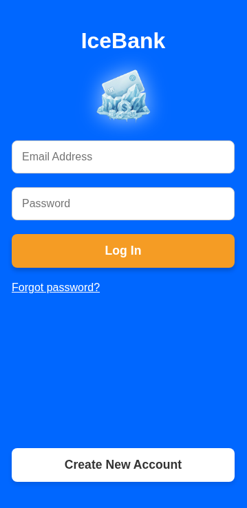
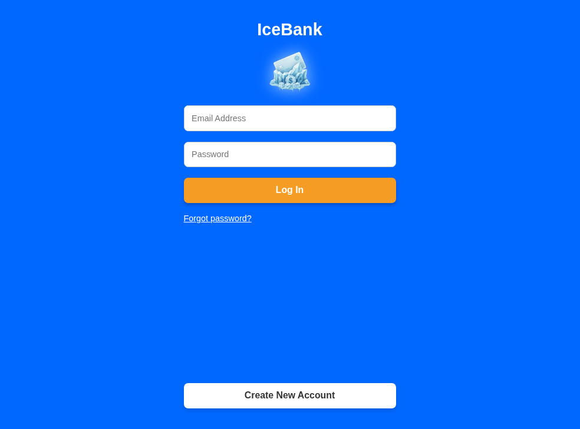
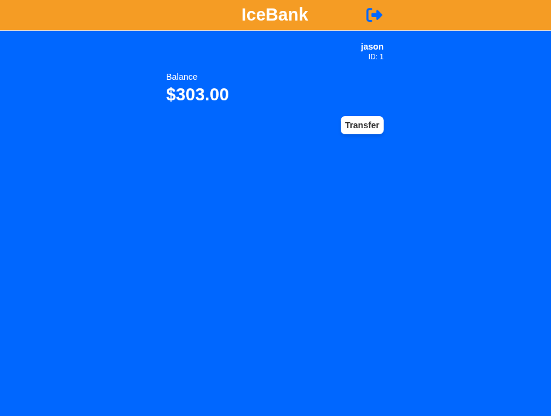
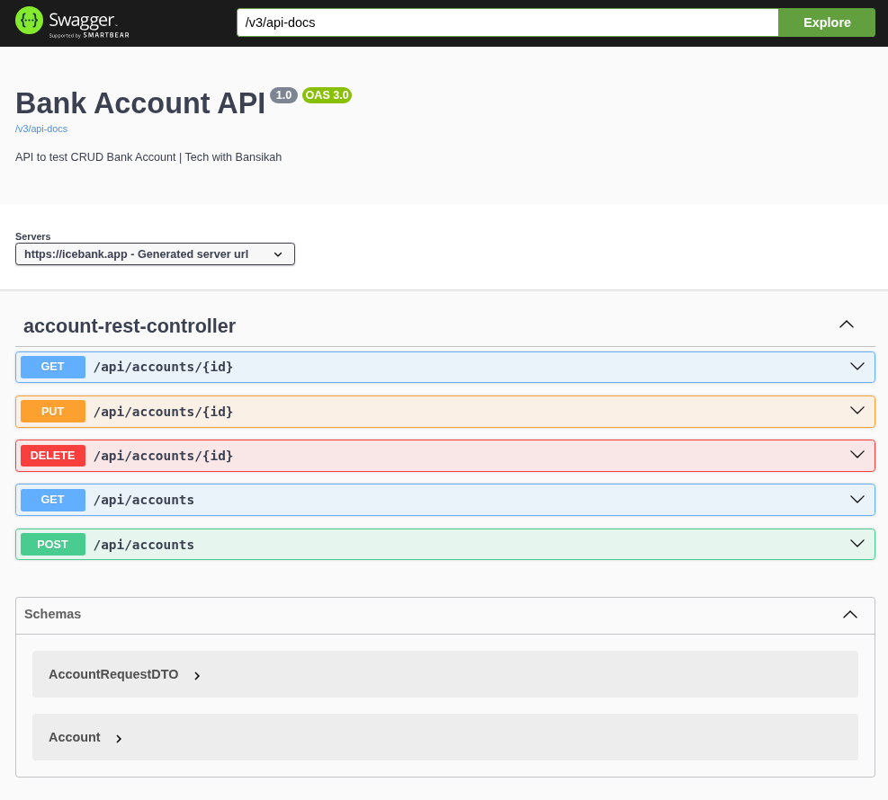

  

<h1 align="center">IceBank</h1>

  A Spring Boot Full-Stack Banking Application

  <a href="https://icebank.app">🌍 Live Application</a> •
  <a href="https://icebank.app/swagger-ui/index.html">📘 Swagger API Docs</a>

---
## 🏛️ Overview
IceBank is a Fullstack banking application designed to demonstrate:

- Clean layered architecture
- Secure authentication and validation
- Cloud deployment with CI/CD

The system manages user accounts, secure registration flows, and automated transaction notifications.

---

## 🛡️ Key Security Features
* **Credential Masking:** Implements the **DTO (Data Transfer Object)** pattern to separate raw user input from persistent database entities.
* **Password Hashing:** Utilizes **BCrypt** hashing to ensure passwords are never stored in plain text.
* **Email Verification:** Uses **Mailtrap** to handle account verification

---

## ⚙️ Tech Stack
| Category | Technology |
| :--- | :--- |
| **Framework** | Spring Boot 3.x (Java 21) |
| **Security** | Spring Security & Jakarta Validation |
| **Database** | H2 (Local) / PostgreSQL (Production) |
| **Deployment** | Railway (CI/CD) |
| **Email Service** | Mailtrap |
| **API Documentation** | OpenAPI 3 / Swagger UI |

## 📸 UI Preview
*Responsive design works across all your devices.*

| Mobile |                                  Desktop                                   |
| :---: |:--------------------------------------------------------------------------:|
|  |  |
|  |  |
---

## Interactive API Documentation
*Explore and test the IceBank API endpoints in real-time.*

  

